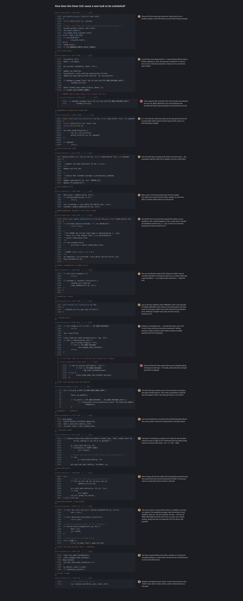

# sidenote

Notes on your code, not next to it.

Ask an agent how something works and you get a wall of prose you then have to
match back against the source by hand. sidenote gives the agent somewhere
better to put the answer: a numbered reading path over your real files, in the
order control flow visits them, with each note in the margin beside the code it
describes. Nothing in your repository is modified.



Layers are ephemeral by design. You ask a question, read the answer against live
source, and throw it away. Nothing to commit, nothing to keep up to date.

## Install

```bash
npm install -g sidenote
```

## Use with Claude Code

```bash
claude mcp add sidenote -- sidenote --root .
```

Then just ask:

> show me how a request gets authenticated

The agent reads the code, emits a layer, and hands back a URL to open — a
numbered, annotated path over your real files.

## How it works

sidenote does no retrieval and makes no LLM calls. It exposes one MCP tool,
`emit_layer`, that takes a title and a list of steps — each a file, a line
range, the exact text of the first line, and one note. The agent supplies those;
sidenote verifies every anchor against disk, numbers the steps, and renders.

If an anchor does not match, the layer is not published and the agent is told
which steps are wrong so it can retry. A confident note beside the wrong snippet
is worse than no tool at all.

## Options

| Flag | Default | Meaning |
| --- | --- | --- |
| `--root <dir>` | `process.cwd()` | Directory all step paths resolve inside. Paths escaping it are rejected. |

## Development

```bash
npm install
npm run build
npm test
npm run typecheck
```
